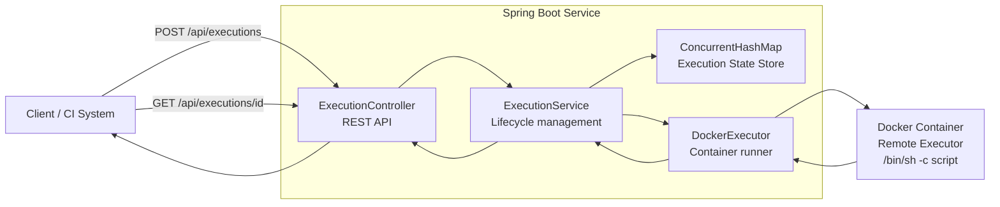

# Remote Command Execution Service

A REST service that executes shell commands on isolated remote executors. Built with **Java 17** and **Spring Boot 3**, using **Docker containers** as the execution backend.

---

## Task requirements and how they are met

| Requirement | Implementation |
|---|---|
| **Send a command script to be executed** | `POST /api/executions` accepts a JSON body with a `script` field containing any shell command or multi-line script. |
| **Specify the necessary resources (e.g. CPU count)** | The request body includes `cpuCount` and `memoryMb` fields. These are forwarded directly to the Docker `--cpus` and `-m` flags when starting the executor container. |
| **Get status of an execution (QUEUED / IN PROGRESS / FINISHED)** | `GET /api/executions/{id}` returns the execution object whose `status` field transitions through `QUEUED` → `IN_PROGRESS` → `FINISHED`. An additional `GET /api/executions` endpoint lists all executions. |
| **When a user sends a command, start a new executor** | Each submission spins up a **new, dedicated Docker container** with the requested resource constraints (`DockerExecutor.startContainer`). |
| **Wait for executor's initialisation** | The service polls `docker inspect` every 500 ms until the container reports `Running: true`, with a 15-second timeout (`DockerExecutor.waitForReady`). |
| **Execute the command on the executor** | The user's script is run inside the container via `docker exec <container> /bin/sh -c "<script>"` (`DockerExecutor.exec`). |
| **Update the execution status** | Status transitions are applied in-place on the `Execution` object: `QUEUED` on submission, `IN_PROGRESS` after the container is ready, `FINISHED` after the script completes (or fails). The `status` field is `volatile` to guarantee visibility across threads. |

---

## Architecture



### Execution lifecycle

When a user submits a script, the service processes it through these stages:

1. **QUEUED** — The `POST` endpoint validates the request, assigns a unique ID, stores the `Execution` object in a `ConcurrentHashMap`, and returns **immediately** with status `QUEUED`. The actual work is dispatched to a background thread pool (`ExecutorService`).
2. **Container start** — The background thread calls `docker run -d --cpus <N> -m <M>m <image> sleep 3600` to create a fresh, resource-constrained container that stays alive for command execution.
3. **Initialisation wait** — The service polls `docker inspect -f '{{.State.Running}}'` every 500 ms until the container reports `true` (up to 15 seconds).
4. **IN_PROGRESS** — Once the container is ready, the execution status is set to `IN_PROGRESS` and the `startedAt` timestamp is recorded.
5. **Script execution** — The user's script is run inside the container via `docker exec <container> /bin/sh -c "<script>"`. Pipes, redirects, and multi-line scripts are all supported because they are passed to `/bin/sh`.
6. **FINISHED** — stdout, exit code, and `finishedAt` timestamp are captured. The status transitions to `FINISHED`. If an error occurs at any stage, the execution still transitions to `FINISHED` with `exitCode: -1` and the `error` field populated.
7. **Cleanup** — The container is force-removed (`docker rm -f`) in a `finally` block, ensuring no containers are leaked regardless of success or failure.

### Why Docker?

Docker containers mirror the lifecycle of cloud VMs (EC2 instances, K8s pods): start, constrain resources, run work, destroy. The `DockerExecutor` class encapsulates **all** Docker CLI calls behind a clean interface, so replacing it with an AWS SDK or Kubernetes client is a localised one-class change.

---

## Project structure

```
src/main/java/com/jetbrains/cloud/
├── Application.java                  # Spring Boot entry point
├── controller/
│   └── ExecutionController.java      # REST API layer (POST, GET, GET-all)
├── model/
│   ├── Execution.java                # Mutable execution state object
│   ├── ExecutionRequest.java         # Request payload (script, cpuCount, memoryMb, image)
│   └── ExecutionStatus.java          # Enum: QUEUED, IN_PROGRESS, FINISHED
└── service/
    ├── DockerExecutor.java           # Low-level Docker CLI wrapper (start, wait, exec, remove)
    └── ExecutionService.java         # Orchestrator: lifecycle management & state transitions

src/test/java/com/jetbrains/cloud/
└── ExecutionControllerTest.java      # 4 integration tests (require Docker)
```

### Key classes

| Class | Responsibility |
|---|---|
| `ExecutionController` | REST endpoints. Validates input (non-blank script, CPU 1–16, memory 64–32768 MB). Returns 201 on submit, 404 for unknown IDs, 400 for invalid input. |
| `ExecutionService` | Orchestrates the full lifecycle on a background thread pool. Owns the `ConcurrentHashMap<String, Execution>` that acts as the in-memory datastore. |
| `DockerExecutor` | Isolates all Docker CLI calls (`docker run`, `docker inspect`, `docker exec`, `docker rm`). Each method maps to one phase of the executor lifecycle. Designed to be swappable for a cloud SDK. |
| `Execution` | Mutable POJO that tracks the full state: ID, script, resource limits, image, status, output, exit code, timestamps, and container ID. |
| `ExecutionRequest` | Immutable-in-practice request DTO. Defaults: `cpuCount=1`, `memoryMb=512`, `image=ubuntu:22.04`. |
| `ExecutionStatus` | Enum with three values: `QUEUED`, `IN_PROGRESS`, `FINISHED`. |

---

## Prerequisites

- **Java 17+** (tested with OpenJDK 23)
- **Docker daemon running** (Docker Desktop or Docker Engine)
- **Gradle 8+** (or use the included wrapper: `./gradlew`)

## Building & Running

```bash
# Build the project
./gradlew build

# Start the service (runs on http://localhost:8080)
./gradlew bootRun
```

---

## API reference

### 1. Submit an execution

```bash
curl -X POST http://localhost:8080/api/executions \
  -H "Content-Type: application/json" \
  -d '{
    "script": "echo hello world && uname -a",
    "cpuCount": 1,
    "memoryMb": 256,
    "image": "alpine:3.19"
  }'
```

| Field | Type | Required | Default | Description |
|---|---|---|---|---|
| `script` | string | **yes** | — | Shell script to execute on the remote executor |
| `cpuCount` | int | no | 1 | Number of CPU cores for the executor (1–16) |
| `memoryMb` | int | no | 512 | Memory limit in MB for the executor (64–32768) |
| `image` | string | no | `ubuntu:22.04` | Docker image to use as the executor environment |

Response (`201 Created`):
```json
{
  "id": "a1b2c3d4e5f6",
  "script": "echo hello world && uname -a",
  "cpuCount": 1,
  "memoryMb": 256,
  "image": "alpine:3.19",
  "status": "QUEUED",
  "createdAt": 1709573000000
}
```

### 2. Poll execution status

```bash
curl http://localhost:8080/api/executions/{id}
```

Response (`200 OK` — after completion):
```json
{
  "id": "a1b2c3d4e5f6",
  "status": "FINISHED",
  "output": "hello world\nLinux 84a3f2... 6.5.0 ...",
  "exitCode": 0,
  "startedAt": 1709573002000,
  "finishedAt": 1709573003000
}
```

Returns `404 Not Found` if the ID does not exist.

Status transitions: `QUEUED` → `IN_PROGRESS` → `FINISHED`.

### 3. List all executions

```bash
curl http://localhost:8080/api/executions
```

Returns a JSON array of all executions, most recent first.

---

## Testing

```bash
./gradlew test
```

**Integration tests require Docker to be running.** The test suite contains 4 tests:

| Test | What it verifies |
|---|---|
| `submitAndPollUntilFinished` | Full end-to-end: submits `echo hello world`, polls until `FINISHED`, asserts `exitCode == 0` and correct output. Proves the entire lifecycle (QUEUED → IN_PROGRESS → FINISHED) works with a real Docker container. |
| `rejectEmptyScript` | Submitting an empty script returns `400 Bad Request`. |
| `notFoundForUnknownId` | Polling a non-existent execution ID returns `404 Not Found`. |
| `listExecutions` | The list endpoint returns `200 OK`. |

---

## Design decisions

| Decision | Rationale |
|---|---|
| **Docker containers as remote executors** | Docker provides real process isolation with CPU/memory constraints, mimicking cloud VMs (EC2, K8s pods). Each execution gets a completely fresh environment. The `DockerExecutor` class encapsulates all Docker calls, making it straightforward to swap in a cloud SDK (e.g. AWS EC2 `RunInstances`, ECS `RunTask`, Kubernetes `Job`). |
| **Asynchronous execution with immediate return** | The `POST` endpoint returns immediately with `QUEUED` status. The caller polls for progress. This matches the pattern used in real cloud platforms where VM provisioning takes time. |
| **In-memory state (`ConcurrentHashMap`)** | Keeps the solution simple and self-contained — no external database required. In production, this would be replaced with a persistent store (PostgreSQL, Redis) for durability and horizontal scaling. |
| **One thread per execution (`CachedThreadPool`)** | Simple and effective for a demonstration. For high throughput, a bounded pool or virtual threads (Java 21+) would be more appropriate. |
| **Resource constraints forwarded to Docker** | `cpuCount` → `--cpus`, `memoryMb` → `-m`. The Docker runtime enforces these limits on the container, so the executor environment genuinely reflects the requested resources. |
| **`volatile` status field** | The `status` field on `Execution` is declared `volatile` to guarantee visibility across the background worker thread (writer) and the HTTP request thread (reader). All data fields are written before the volatile status update, so the Java Memory Model's happens-before guarantee ensures readers see consistent state once `status` changes. |
| **Container cleanup in `finally`** | `docker rm -f` runs in a `finally` block so containers are always cleaned up, even when the script or Docker itself fails. |
| **Error handling** | If any stage fails (container start, init wait, script execution), the execution transitions to `FINISHED` with `exitCode: -1` and the `error` field populated with the exception message. The container is still cleaned up. |

## Possible future improvements

- **Persistent storage** — Replace the `ConcurrentHashMap` with a database for durability across restarts.
- **Streaming output** — Use WebSockets or SSE to stream stdout in real-time instead of collecting it all at the end.
- **Execution timeout** — Add a configurable timeout so long-running scripts are killed automatically.
- **Authentication** — Secure the API with API keys or OAuth tokens.
- **Docker SDK** — Replace CLI calls with the Docker Java SDK (`docker-java`) or switch to a cloud provider SDK for actual VM-based executors.
